# 🧩 Active Directory & Windows Server Labs

> Simulating a **real-world small business IT infrastructure** — from Domain Controller setup to Group Policy enforcement and client domain joining.

<div align="center">


</div>

---

## 📌 Overview

This repository documents hands-on labs for deploying and managing a **Windows Server Active Directory (AD) environment**, where an IT administrator is responsible for domain setup, user management, Group Policy configuration, client onboarding, and system troubleshooting.

---

## 🎯 Objectives & 🛠️ Technologies

<table>
<tr>
<td width="50%" valign="top">

**Objectives**

- 🏗️ Build a fully functional **Active Directory environment**
- 🌐 Understand **domain-based network architecture**
- 👥 Practice **user and access management**
- 🔒 Implement **security policies via Group Policy**
- 🧰 Gain real-world **IT Support / SysAdmin experience**

</td>
<td width="50%" valign="top">

**Technologies**

- 🪟 Windows Server 2025
- 💻 Windows 10 (Client Machine)
- 🗂️ Active Directory Domain Services (AD DS)
- 📋 Group Policy Management
- ⚙️ VMware Workstation Pro
- 🐧 Ubuntu (Host Machine)

</td>
</tr>
</table>

---

## 🧪 Lab Structure

| #   | Lab                                                               | Status       |
| --- | ----------------------------------------------------------------- | ------------ |
| 1   | Windows Server Installation                                       | ✅ Completed |
| 2   | Active Directory Domain Controller Setup                          | ✅ Completed |
| 3   | User & Organizational Unit (OU) Management                        | ✅ Completed |
| 4   | Active Directory Groups – Security vs Distribution & Adding Users | ✅ Completed |
| 5   | Group Policy Configuration – Creating & Linking a GPO             | ✅ Completed |
| 6   | Folder Redirection via Group Policy                               | ✅ Completed |
| 7   | Mapping Network Drives via Group Policy                           | ✅ Completed |
| 8   | Adding a Second Domain Controller (Server 2025)                   | ✅ Completed |

---

# 🚀 Lab 1 — Windows Server Installation

## 🖥️ Environment & VM Configuration

<table>
<tr>
<td width="50%" valign="top">

**Environment**

- **Host OS:** Ubuntu
- **Virtualization:** VMware Workstation Pro
- **Guest OS:** Windows Server 2025

</td>
<td width="50%" valign="top">

**Recommended VM Specs**

- **RAM:** 2 GB min _(4 GB recommended)_
- **Storage:** 60 GB minimum
- **CPU:** 2 cores
- **Network:** NAT _(for internet access)_

</td>
</tr>
</table>

---

## 📋 Setup Steps

**Step 1 — Install VMware Workstation Pro**
Download and install VMware Workstation Pro on your Ubuntu host machine.

**Step 2 — Download Windows Server ISO**
Grab the **Windows Server 2025 ISO** from the [Microsoft Evaluation Center](https://www.microsoft.com/en-us/evalcenter/).

**Step 3 — Create a New Virtual Machine**
Create a new VM in VMware using the recommended configuration above.

**Step 4 — Install Windows Server**
Attach the ISO → Power on the VM → Follow the installation wizard → Select **Standard with Desktop Experience** → Complete setup and log in.

---

## ✅ Outcome

- Successfully installed **Windows Server 2025** on VMware Workstation
- Virtual machine is fully operational and accessible
- Environment is ready for **Active Directory configuration** _(Lab 2)_

---

## 📸 Screenshots

<p align="center">
  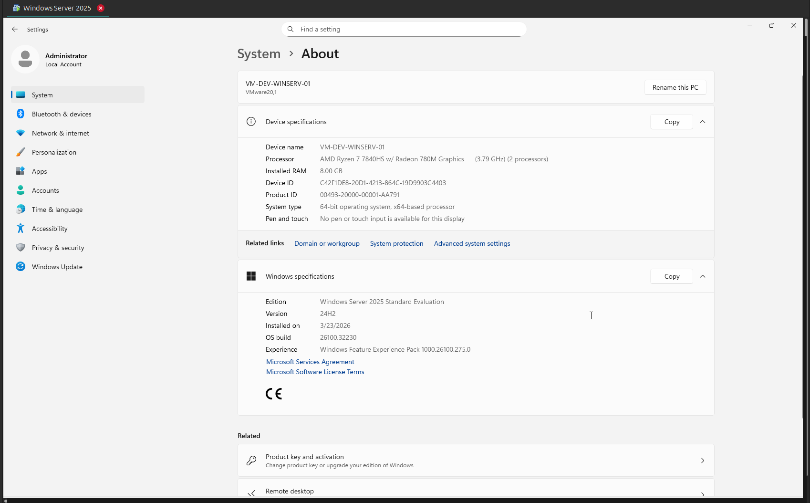
  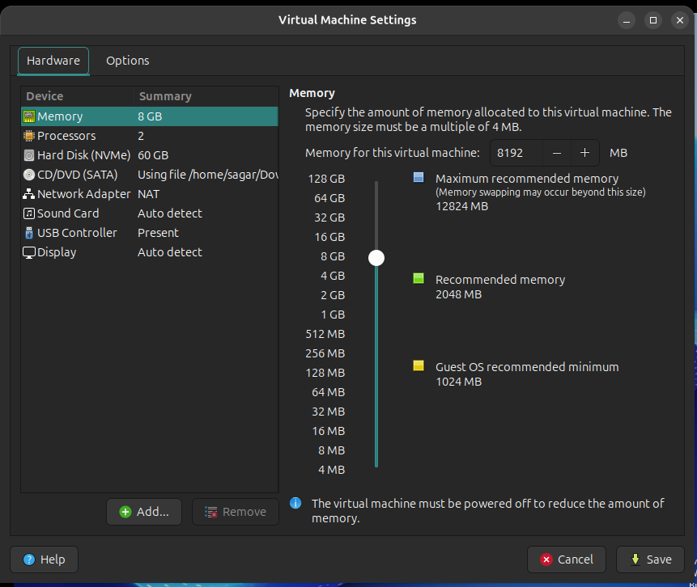
</p>

---

# 🚀 Lab 2 — Active Directory Domain Controller Setup

## 🖥️ What Was Configured

<table>
<tr>
<td width="33%" valign="top">
 
**🖊️ Renamed Windows 11 PC**
- Renamed the client machine to a meaningful hostname before joining it to the domain
- Requires a **restart** to apply
 
</td>
<td width="33%" valign="top">
 
**🌐 Static IP Address**
- Assigned a **manual static IPv4 address** to the server so it is always reachable at a fixed address
- Required for reliable DNS and AD DS operation
 
</td>
<td width="33%" valign="top">
<td width="33%" valign="top">
 
**🗂️ Installed & Promoted AD DS**
- Installed the **AD DS role** via Server Manager
- Promoted the server to a **Domain Controller**
- Created a new **forest and root domain**
 
</td>
</tr>
<tr>
<td width="50%" valign="top">
 
**📡 Pinged Windows Server 2025**
- Verified **network connectivity** between the Windows 11 client and the Windows Server 2025 VM
- Confirmed the static IP was reachable before attempting domain join
 
</td>
<td width="50%" valign="top">
 
**🔗 Joined Windows 11 PC to the Domain**
- Joined the Windows 11 client machine to the **Active Directory domain**
- Verified successful domain membership via **System Properties**
 
</td>
</tr>
</table>
 
---
 
## 📋 Setup Steps
 
**Step 1 — Rename the Windows 11 PC**
Open **Settings → System → About → Rename this PC** → Enter a descriptive hostname (`Workstation01`) → Restart to apply.
 
**Step 2 — Configure a Static IP Address on the Server**
Go to **Network Adapter Settings → IPv4 Properties** and set:
 
 ## Windows Server 2025 Static IP Configuration

| Field           | Value                                             |
| --------------- | ------------------------------------------------- |
| IP Address      | `192.168.1.10`                                    |
| Subnet Mask     | `255.255.255.0`                                   |
| Default Gateway | `192.168.1.1`                                     |
| Preferred DNS   | `127.0.0.1` _(points to itself after AD install)_ |

## Client Machine ( Windows 11) Static IP Configuration

| Field           | Value                                                          |
| --------------- | -------------------------------------------------------------- |
| IP Address      | `192.168.1.11`                                                 |
| Subnet Mask     | `255.255.255.0`                                                |
| Default Gateway | `192.168.1.1`                                                  |
| Preferred DNS   | `192.168.1.10` _(points to Windows Server)_                    |
| Alternate DNS   | `192.168.1.1` _(points to any other server on the IP gateway)_ |

**Step 3 — Install the AD DS **
Open **Server Manager → Add Roles and Features** → Select **Active Directory Domain Services** → Proceed through the wizard and install.

**Step 4 — Promote Server to Domain Controller**
After installation, click **Promote this server to a domain controller** in Server Manager → Select **Add a new forest** → Enter your **Root Domain Name** (`InfoTech.com`) → Set a DSRM password → Complete the wizard → Server will **restart automatically**.

**Step 5 — Ping the Windows Server 2025**
On the Windows 11 client, open **Command Prompt** and run:

```
ping 192.168.1.10
```

Confirm you receive replies — this verifies network connectivity between the client and the server before proceeding with domain join.

**Step 6 — Join the Windows 11 PC to the Domain**
On the Windows 11 client, go to **Settings → System → About → Advanced system settings → Computer Name → Change** → Select **Domain** → Enter your domain name (`InfoTech.com`) → Provide **Domain Admin credentials** when prompted → Restart to complete.

---

## ✅ Outcome

- Windows 11 client machine successfully **renamed** to a meaningful hostname
- **Static IP** configured — server is reachable at a fixed network address
- **AD DS role** installed and server promoted to **Domain Controller**
- New **Active Directory forest and domain** created and operational
- **Ping test** confirmed network connectivity between client and server
- Windows 11 PC successfully **joined to the Active Directory domain**

---

## 📸 Screenshots

<p align="center">
  
  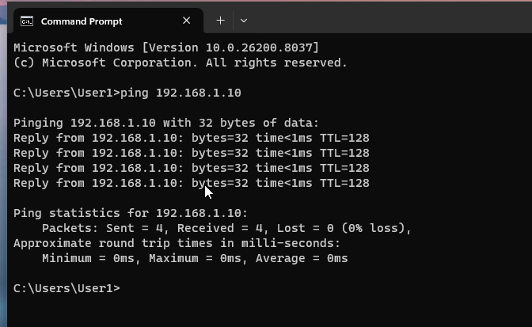
</p>
<p align="center">
  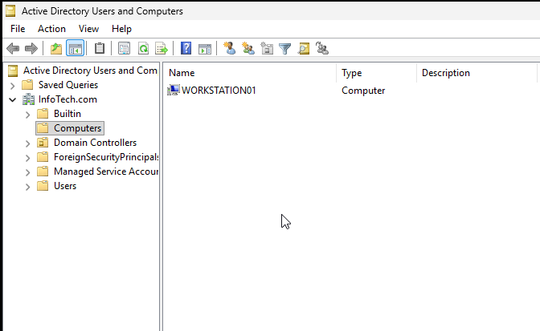
</p>
 
---
 # 🚀 Lab 3 — User & Organizational Unit (OU) Management
 
## 🖥️ What Was Configured
 
<table>
<tr>
<td width="50%" valign="top">
 
**👤 Created a New User & Logged In**
- Created a new **AD user account** via Active Directory Users and Computers (ADUC)
- Set a secure password and configured login settings
- Logged into the domain-joined Windows 11 PC using the **new user account** to verify access
 
</td>
<td width="50%" valign="top">
 
**🗂️ Set Up an Organizational Unit (OU)**
- Created a dedicated **Organizational Unit** in ADUC to mirror a real-world department structure
- OUs allow administrators to apply **targeted Group Policies** and delegate permissions at a granular level
 
</td>
</tr>
<tr>
<td width="50%" valign="top">
 
**🧑‍💼 Added a Helpdesk User to the OU**
- Created a ** Helpdesk user account ( `John Doe`) ** and placed it inside the newly created OU (`IT_Staff`)
- Organised users by role/department for cleaner AD structure and easier management
 
</td>
<td width="50%" valign="top">
 
**🗝️ Delegated Control**
- Used the **Delegation of Control Wizard** to grant the Helpdesk user specific administrative permissions
- Helpdesk can now perform tasks (e.g., create,edit or delete user,reset passwords) **without needing full Domain Admin rights**
- Follows the **principle of least privilege**
 
</td>
</tr>
</table>
 
---
 
## 📋 Setup Steps
 
**Step 1 — Create a New User Account**
Open **Active Directory Users and Computers (ADUC)** → Expand your domain → Right-click **Users** → **New → User** → Fill in the name and username → Set a password → Finish.
 
**Step 2 — Log In with the New Account**
On the domain-joined Windows 11 PC, sign out → Log in with the new domain user credentials (e.g., `INFOTECH/john`) → Verify successful access.
 
**Step 3 — Create an Organizational Unit (OU)**
In **ADUC** → Right-click your domain → **New → Organizational Unit** → Name it (`IT_Staff`) → Click OK.
 
**Step 4 — Add the Helpdesk User to the OU**
In **ADUC** → Right-click **Users** → **New → User** → Create the Helpdesk user → Once created, drag or **move** the user into the new OU, or create it directly inside the OU from the start.
 
**Step 5 — Delegate Control to the Helpdesk User**
Right-click the **OU** in ADUC → **Delegate Control** → Click **Add** → Search for the Helpdesk user → Select the tasks to delegate (e.g., *Reset user passwords and force password change at next logon*) → Complete the wizard.
 
---
 
## ✅ Outcome
 
- New **AD user account** created and login verified on domain-joined Windows 11 PC
- **Organizational Unit (OU)** created to logically structure users by role
- **Helpdesk user** added to the OU for organised, policy-ready management
- **Control delegated** to Helpdesk user — can perform specific admin tasks without Domain Admin privileges
- AD structure now reflects a **real-world least-privilege model**

---

## 📸 Screenshots

<p align="center">
  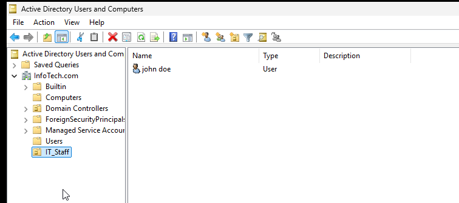

</p>
 
---

# 🚀 Lab 4 — Active Directory Groups: Security vs Distribution & Adding Users

## 🔍 Key Concept: Security vs Distribution Groups

<table>
<tr>
<td width="50%" valign="top">
 
**🔒 Security Group — `IT_Staff`**
- Used to **control access to resources** (folders, printers, shared drives)
- Members: **Paula Doe**, **Ram Doe**
- Permissions can be assigned directly to the group — no need to manage individual users
- Best practice for enforcing **least-privilege access**
 
</td>
<td width="50%" valign="top">
 
**📧 Distribution Group — `All_Staff`**
- Used for **email distribution lists** — cannot be used to assign resource permissions
- Members: **Paula Doe**, **Ram Doe**, **Dave Doe**
- Ideal for org-wide communications without granting system access
- Not a security boundary — use Security Groups for access control
 
</td>
</tr>
</table>
 
---
 
## 🖥️ What Was Configured
 
<table>
<tr>
<td width="50%" valign="top">
 
**👥 Created Groups & Added Users**
- Created `IT_Staff` as a **Security Group** and `All_Staff` as a **Distribution Group** in ADUC
- Added **Paula Doe** and **Ram Doe** to `IT_Staff`
- Added **Paula Doe**, **Ram Doe**, and **Dave Doe** to `All_Staff`
 
</td>
<td width="50%" valign="top">
 
**📁 Created & Shared a Folder**
- Created folder `IT_Docs` on Windows Server 2025 with a file `HelloPaula.txt` inside
- Shared `IT_Docs` with the `IT_Staff` Security Group with **Read access** via folder Properties → Sharing
- Only members of `IT_Staff` can access the shared folder
 
</td>
</tr>
<tr>
<td width="50%" valign="top">
 
**✅ Verified Access — Paula Doe**
- Logged into the Windows 11 client machine using **Paula's** domain account
- Successfully accessed the `IT_Docs` shared folder and the `HelloPaula.txt` file
- Confirmed Security Group permissions are working correctly
 
</td>
<td width="50%" valign="top">
 
**❌ Verified Access Denied — Dave Doe**
- Logged into the Windows 11 client machine using **Dave's** domain account
- Access to `IT_Docs` was **denied** — as expected, since Dave is not a member of `IT_Staff`
- Demonstrates how Security Groups enforce access boundaries effectively
 
</td>
</tr>
</table>
 
---
 
## 📋 Setup Steps
 
**Step 1 — Create the Security Group (`IT_Staff`)**
In **ADUC** → Expand your domain → Right-click **Users** (or your OU) → **New → Group** → Name it `IT_Staff` → Set *Group type* to **Security** → Set *Group scope* to **Global** → Click OK.
 
**Step 2 — Create the Distribution Group (`All_Staff`)**
Repeat the same process → Name it `All_Staff` → Set *Group type* to **Distribution** → Click OK.
 
**Step 3 — Create Users & Add to Groups**
Create users **Paula Doe**, **Ram Doe**, and **Dave Doe** in ADUC. Then:
 
| User | IT_Staff (Security) | All_Staff (Distribution) |
|------|:-------------------:|:------------------------:|
| Paula Doe | ✅ | ✅ |
| Ram Doe | ✅ | ✅ |
| Dave Doe | ❌ | ✅ |
 
To add members: Right-click the group → **Properties → Members tab → Add** → Search for the user → OK.
 
**Step 4 — Create the Shared Folder on the Server**
On Windows Server 2025, create a folder named `IT_Docs` → Inside, create a text file named `HelloPaula.txt` → Right-click `IT_Docs` → **Properties → Sharing tab → Share** → Type `IT_Staff` → Set permission to **Read** → Share.
 
**Step 5 — Verify Access as Paula Doe (IT_Staff Member)**
On the Windows 11 client, log in as **Paula Doe** → Open **File Explorer** → Navigate to `\\VM-DEV-SERV-\IT_Docs` → Confirm the folder and `HelloPaula.txt` are accessible. ✅
 
**Step 6 — Verify Access Denied as Dave Doe (Non-Member)**
Log out → Log in as **Dave Doe** → Attempt to access `\\VM-DEV-SERV-\IT_Docs` → Access should be **denied**, confirming the Security Group restriction is working as intended. ❌
 
---
 
## ✅ Outcome
 
- Understood the difference between **Security Groups** (access control) and **Distribution Groups** (email only)
- Created `IT_Staff` (Security) and `All_Staff` (Distribution) with the correct group types
- Added **Paula** and **Ram** to `IT_Staff`; all three users added to `All_Staff`
- Created shared folder `IT_Docs` with `HelloPaula.txt` and restricted access to `IT_Staff`
- **Paula** successfully accessed the shared folder ✅ — **Dave** was correctly denied ❌
- Demonstrated how **AD Security Groups make access management scalable and secure**
 
---
 
## 📸 Screenshots
 
<p align="center">
  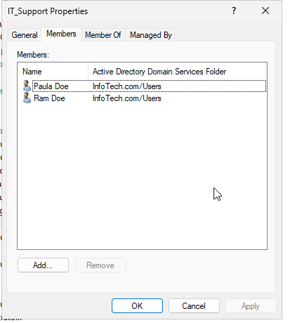
  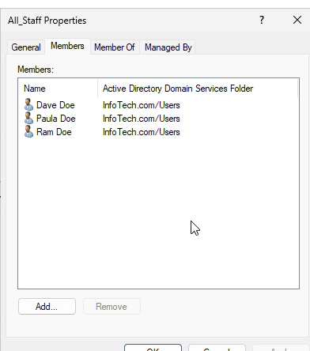
</p>
<p align="center">
  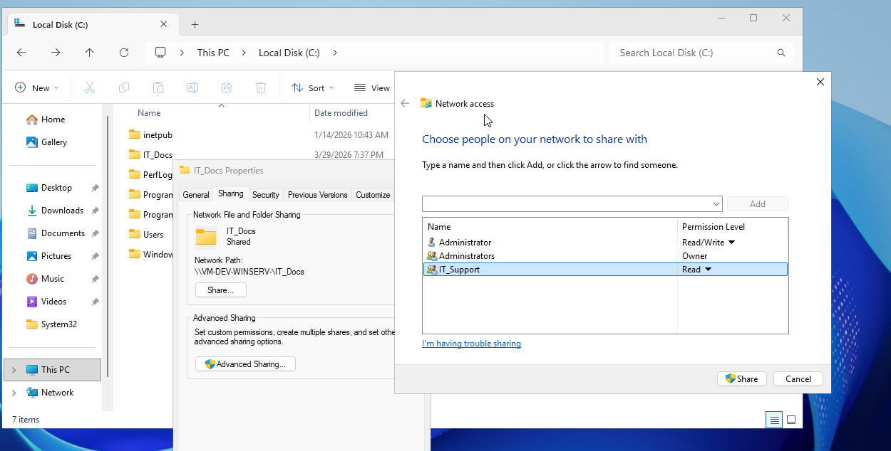
  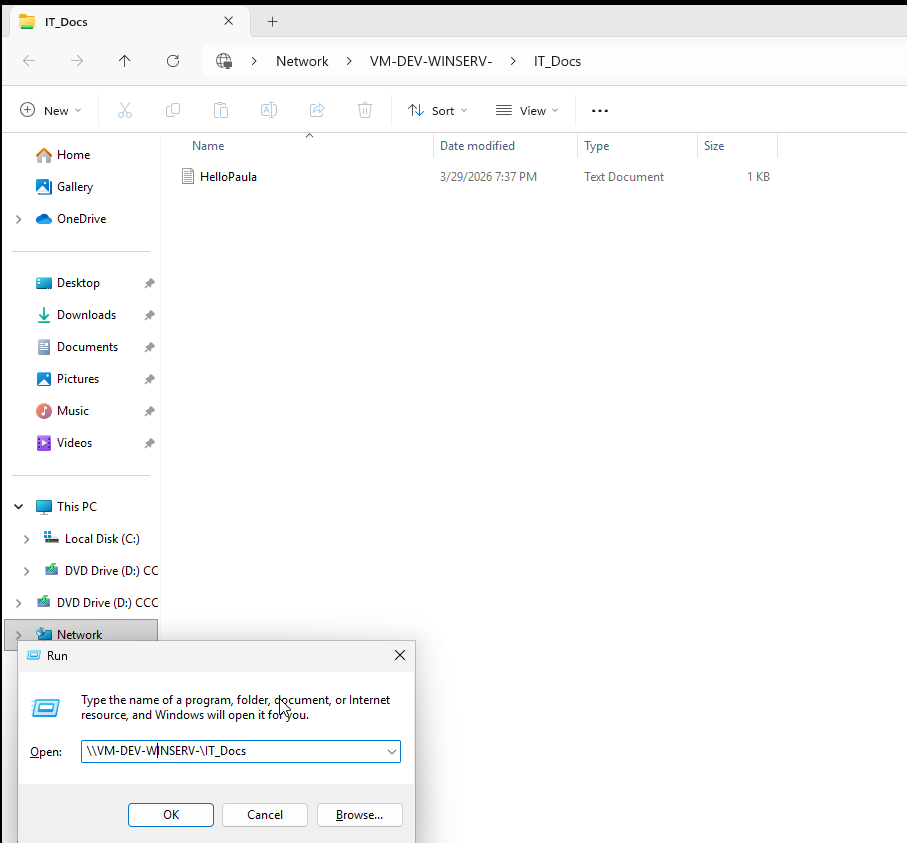
</p>

<p align="center">
  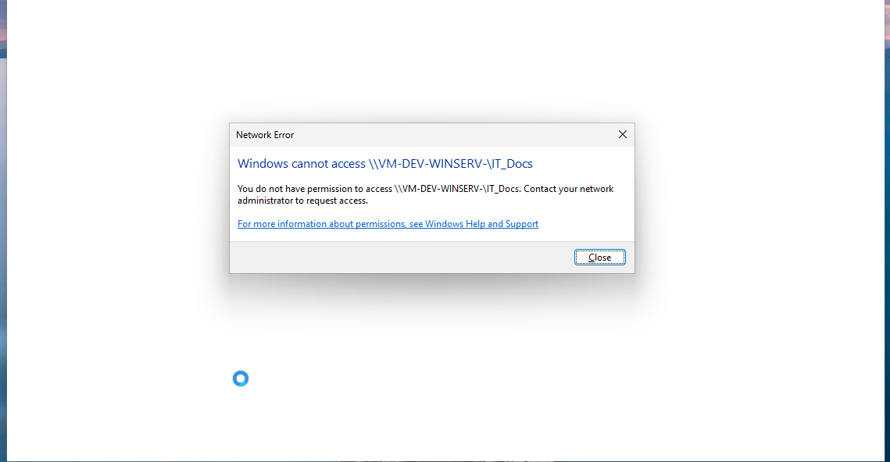
</p>
 
---

# 🚀 Lab 5 — Group Policy Configuration: Creating & Linking a GPO

## 🔍 Key Concept: GPO Creation vs Linking

> Creating a GPO is only the first step — **until it's linked to an OU, it does absolutely nothing.**
> This lab covers the full lifecycle: create → configure → link → force → verify.

<table>
<tr>
<td width="50%" valign="top">
 
**📋 What is a GPO?**
- A **Group Policy Object (GPO)** is a collection of settings that control the working environment of user accounts and computer accounts
- GPOs are managed via the **Group Policy Management Console (GPMC)**
- They must be **linked to an OU, domain, or site** before they take effect
 
</td>
<td width="50%" valign="top">
 
**⚙️ How GPO Application Works**
- GPO is created in GPMC → configured with desired settings → linked to a target OU
- Clients receive the policy either at **next login** or after running `gpupdate /force`
- `gpresult /r` lets you verify exactly which policies are applied to a user or machine
 
</td>
</tr>
</table>
 
---
 
## 🖥️ What Was Configured
 
<table>
<tr>
<td width="50%" valign="top">
 
**🗂️ Created `All_Staff` OU & Moved Users**
- Created a new Organizational Unit named `All_Staff` in ADUC
- Moved all previously created users (**Paula Doe**, **Ram Doe**, **Dave Doe**) into this OU
- Ensures the GPO targets the correct set of users when linked
 
</td>
<td width="50%" valign="top">
 
**🛡️ Created GPO — `Disable_Control_Panel`**
- Opened **Group Policy Management Console (GPMC)**
- Created a new GPO named `Disable_Control_Panel`
- Navigated into the GPO and **enabled the setting** to restrict access to the Control Panel and Settings
 
</td>
</tr>
<tr>
<td width="50%" valign="top">
 
**🔗 Linked the GPO to `All_Staff` OU**
- Linked the `Disable_Control_Panel` GPO directly to the `All_Staff` OU
- This ensures the policy applies to **all users inside that OU** and no one else
- Without this link, the GPO would exist but never apply
 
</td>
<td width="50%" valign="top">
 
**🔄 Forced & Verified Policy Application**
- Ran `gpupdate /force` on the server to push the policy immediately
- Logged into the client as **Paula Doe** and ran `gpresult /r` to confirm the GPO appeared under *Applied Group Policy Objects*
- Attempted to open **Control Panel** — access was **denied** ✅
 
</td>
</tr>
</table>
 
---
 
## 📋 Setup Steps
 
**Step 1 — Create the `All_Staff` OU & Move Users**
In **ADUC** → Right-click your domain → **New → Organizational Unit** → Name it `All_Staff` → Click OK.
Then move **Paula Doe**, **Ram Doe**, and **Dave Doe** into it: right-click each user → **Move** → Select the `All_Staff` OU.
 
**Step 2 — Create the GPO**
Open **Group Policy Management** (via Server Manager or `gpmc.msc`) → Expand your domain → Right-click **Group Policy Objects** → **New** → Name it `Disable_Control_Panel` → Click OK.
 - Ready for **Group Policy Configuration** *(Lab 5)*
**Step 3 — Configure the GPO Setting**
Right-click `Disable_Control_Panel` → **Edit** → Navigate to:
```
User Configuration → Policies → Administrative Templates
→ Control Panel → Prohibit access to Control Panel and PC Settings
```
Double-click the setting → Set to **Enabled** → Click OK → Close the editor.
 
**Step 4 — Link the GPO to the `All_Staff` OU**
In **GPMC**, right-click the `All_Staff` OU → **Link an Existing GPO** → Select `Disable_Control_Panel` → Click OK.
The GPO is now active for all users in that OU.
 
**Step 5 — Force the Policy Update on the Server**
On the Windows Server, open **Command Prompt** as Administrator and run:
```
gpupdate /force
```
This pushes the policy immediately without waiting for the next refresh cycle.
 l Panel** or **Settings** → Access should be **denied** with a restriction message, confirming the GPO is working as expected. ✅
 
---
 
## ✅ Outcome
 
- Created `All_Staff` OU and moved all users into it for targeted policy application
- Created the `Disable_Control_Panel` GPO in Group Policy Management Console
- Enabled the **Prohibit access to Control Panel and PC Settings** policy within the GPO
- Successfully **linked** the GPO to the `All_Staff` OU
- Ran `gpupdate /force` to push the policy immediately — no reboot required
- Verified via `gpresult /r` that the GPO appeared under applied policies on the client machine
- Confirmed **Control Panel access was denied** on Paula's account ✅

---

## 📸 Screenshots

<p align="center">
  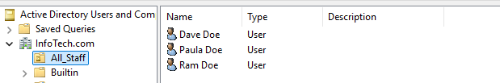
  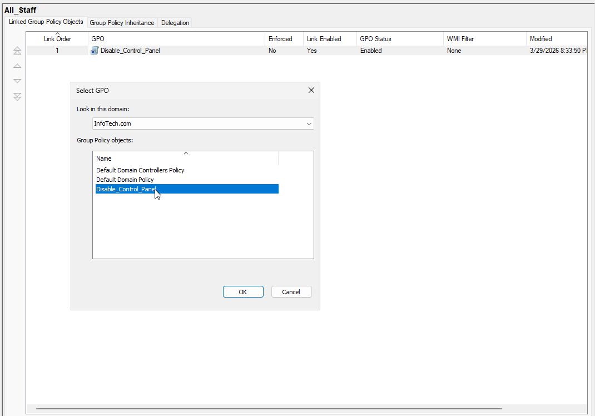
  
</p>
<p align="center">
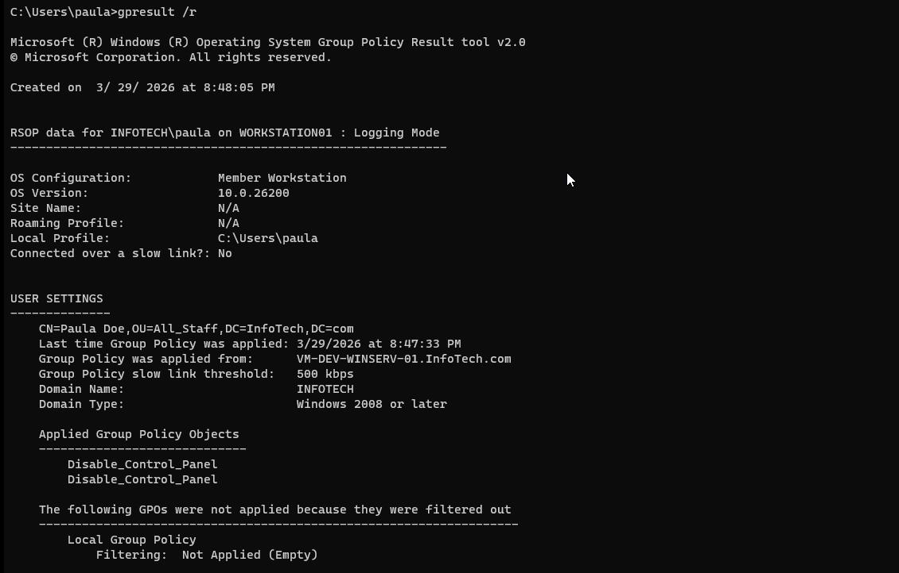
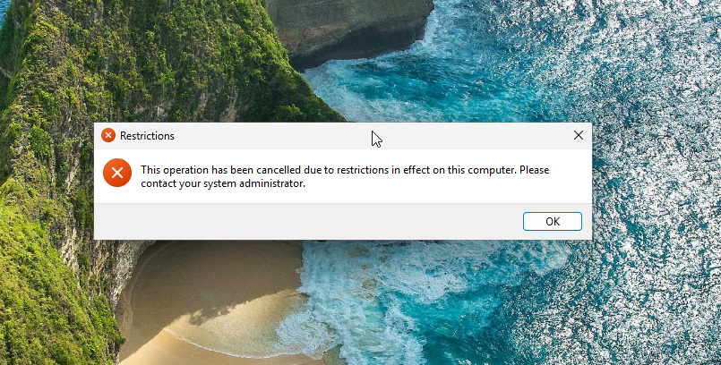 
</p>
 
---

# 🚀 Lab 6 — Folder Redirection via Group Policy

## 🔍 Key Concept: What is Folder Redirection?

> By default, a user's Documents folder lives **only on their local machine** — if the machine fails or they log in from a different PC, their files are gone.
> **Folder Redirection** uses a GPO to transparently point each user's personal folders (e.g., Documents) to a **central location on the server** — so files follow the user, not the machine.

<table>
<tr>
<td width="50%" valign="top">
 
**📁 Why Redirect Folders?**
- User files are stored **centrally on the server** — not on the local machine
- Users can log into **any domain-joined PC** and access their files seamlessly
- Simplifies **backup and disaster recovery** — back up the server, protect everyone's data
- Transparent to the end user — Documents still appears as `Documents` on their machine
 
</td>
<td width="50%" valign="top">
 
**🔒 Per-User Isolation**
- Each user gets their **own private subfolder** inside the shared redirection path
- Permissions are automatically scoped — **Paula cannot see Dave's folder and vice versa**
- This mirrors real-world enterprise environments where roaming profiles and folder redirection work together
 
</td>
</tr>
</table>
 
---
 
## 🖥️ What Was Configured
 
<table>
<tr>
<td width="50%" valign="top">
 
**📂 Created & Shared `Redirected_Folders` on the Server**
- Created a folder named `Redirected_Folders` on the `C:` drive of Windows Server 2025
- Opened **Properties → Security → Advanced** and granted **Full Control** to *Everyone*
- This gives the GPO the ability to automatically create per-user subfolders at login
 
</td>
<td width="50%" valign="top">
 
**⚙️ Created & Linked the GPO `Folder_Redirection_Policy`**
- In **Group Policy Management**, selected the domain → navigated to the `All_Staff` OU
- Created a new GPO named `Folder_Redirection_Policy` and linked it directly to the `All_Staff` OU
- Configured the GPO to redirect the **Documents** folder to `\\VM-DEV-WINSERV-\Redirected_Folders`
 
</td>
</tr>
<tr>
<td width="50%" valign="top">
 
**✅ Verified Redirection — Paula Doe**
- Logged into the client as **Paula Doe** → ran `gpupdate /force` → signed out and back in
- Navigated to `C:\Redirected_Folders` → Paula's personal subfolder was **automatically created**
- Inside Paula's folder → `Documents` → created a new test file — confirmed redirection is working ✅
 
</td>
<td width="50%" valign="top">
 
**🔒 Verified Isolation — Dave Doe**
- Logged out of Paula's account → logged in as **Dave Doe** → applied policy with `gpupdate /force`
- Dave's own subfolder was created under `Redirected_Folders`
- Attempted to access **Paula's subfolder** — access was **denied** ❌
- Confirmed per-user folder isolation is enforced correctly
 
</td>
</tr>
</table>
 
---
 
## 📋 Setup Steps
 
**Step 1 — Create & Share the `Redirected_Folders` Folder on the Server**
On Windows Server 2025, create a folder at `C:\Redirected_Folders` → Right-click → **Properties → Security tab → Advanced** → Add **Everyone** with **Full Control** permissions → Apply.
 
Then share the folder: **Properties → Sharing tab → Advanced Sharing** → Check *Share this folder* → Set the share name (e.g., `Redirected_Folders`) → Under **Permissions**, grant **Everyone – Full Control** → OK.
 
**Step 2 — Create the GPO `Folder_Redirection_Policy`**
Open **Group Policy Management** (`gpmc.msc`) → Expand your domain → Right-click the `All_Staff` OU → **Create a GPO in this domain and Link it here** → Name it `Folder_Redirection_Policy` → Click OK.
*(This creates and links the GPO to the OU in one step.)*
 
**Step 3 — Configure Folder Redirection inside the GPO**
Right-click `Folder_Redirection_Policy` → **Edit** → Navigate to:
```
User Configuration → Policies → Windows Settings
→ Folder Redirection → Documents
```
Right-click **Documents** → **Properties** → Set *Setting* to **Basic – Redirect everyone's folder to the same location** → Set the root path to:
```
\\VM-DEV-WINSERV-01\Redirected_Folders
```
Click OK → Accept any prompts about exclusive rights.
 
**Step 4 — Apply the Policy on the Client (Paula Doe)**
Log into the Windows 11 client as **Paula Doe** → Open **Command Prompt** and run:
```
gpupdate /force
```
Sign out and log back in to trigger folder redirection on first login.
 
**Step 5 — Verify Paula's Redirected Folder on the Server**
On the server, browse to `C:\Redirected_Folders` → Paula's subfolder should have been **automatically created** → Open it → navigate to `Documents` → create a new test file to confirm the redirection is live. ✅
 
**Step 6 — Verify Isolation as Dave Doe**
Log out of Paula's account → Log in as **Dave Doe** → run `gpupdate /force` → sign out and back in.
Attempt to navigate to `\\ServerName\Redirected_Folders\Paula` → Access should be **denied** ❌, confirming that per-user folder isolation is correctly enforced.
 
---
 
## ✅ Outcome
 
- Created and shared `Redirected_Folders` on Windows Server 2025 with correct permissions
- Created and linked the `Folder_Redirection_Policy` GPO to the `All_Staff` OU
- Configured **Documents** folder redirection to the central server share via GPO
- Paula's subfolder was **automatically created** on the server upon first login ✅
- Test file created inside Paula's redirected Documents — redirection confirmed working
- Dave's folder was created separately — **Dave could not access Paula's folder** ❌
- Demonstrated real-world **per-user folder isolation** and **centralised data storage**
 
---
 
## 📸 Screenshots
 
<p align="center">
  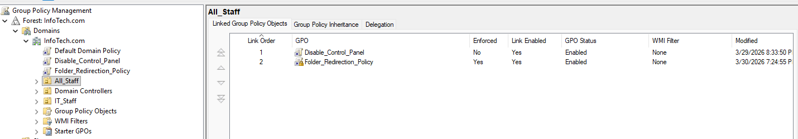
  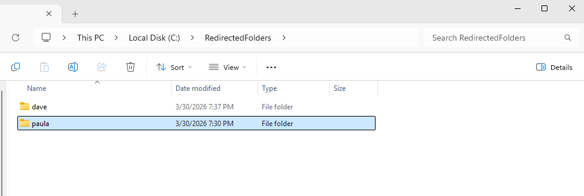
</p>
 
---

# 🚀 Lab 7 — Mapping Network Drives via Group Policy

## 🔍 Key Concept: Shared Drives vs Personal Drives

> In an enterprise environment, users need two types of mapped drives:
> a **shared group drive** (same folder for everyone in a department) and a **personal drive** (private to each individual user).
> Both can be automatically mapped at login using GPO — no manual setup needed on each machine.

<table>
<tr>
<td width="50%" valign="top">
 
**📁 Group Drive — `HR` Share**
- A single shared folder (`C:\Shares\HR`) accessible to **all members of the HR Security Group**
- Mapped as **drive Z:** on every HR member's machine automatically
- Permissions are scoped to the `HR` group — non-members cannot access it
- Ideal for department-wide files, templates, and shared resources
 
</td>
<td width="50%" valign="top">
 
**🔐 Personal Drive — `Personal` Share with `%username%`**
- A single share (`C:\Shares\Personal`) that uses the **`%username%` variable** to map a private subfolder per user
- Paula sees `paula (\\VM-DEV-WINSERV-\Personal)` — Dave sees his own — neither can access the other's
- Centralises personal storage on the server while keeping each user's data **completely isolated**
- Replaces the need for local user profile storage on individual machines
 
</td>
</tr>
</table>
 
---
 
## 🖥️ What Was Configured
 
<table>
<tr>
<td width="50%" valign="top">
 
**📂 Created Shared Folders on the Server**
- Created `C:\Shares\HR` and `C:\Shares\Personal` on Windows Server 2025
- Shared both via **Server Manager → File and Storage Services → Shares → New Share Wizard**
- Share names: `HR` (remote path `\\VM-DEV-WINSERV-01\HR`) and `Personal` (`\\VM-DEV-WINSERV-01\Personal`)
- Both confirmed live in the Shares panel alongside IT_Docs and RedirectedFolders
 
</td>
<td width="50%" valign="top">
 
**🔒 Configured Folder Permissions**
- Opened folder **Properties → Security** on both shares
- **Disabled inheritance** to remove default permissions and start clean
- Assigned the `HR` Security Group explicit permissions to the `HR` share
- Configured the `Personal` share to allow users access only to their own subfolder via `%username%`
 
</td>
</tr>
<tr>
<td width="50%" valign="top">
 
**👥 Created `HR` Security Group in ADUC**
- Opened **Active Directory Users and Computers** in the `InfoTech.com` domain
- Created a new group named `HR` with **Global scope** and **Security** type
- Added the relevant users to the `HR` group so they inherit access to the HR shared drive
 
</td>
<td width="50%" valign="top">
 
**🗺️ Mapped Network Drives on the Client**
- **HR drive** → mapped as `Z:` pointing to `\\VM-DEV-WINSERV-01\HR` — visible to HR group members
- **Personal drive** → mapped using `%username%` variable pointing to `\\VM-DEV-WINSERV-01\Personal\%username%` — Paula's machine shows her own `paula` subfolder automatically
- Both drives visible under **Network Locations** in *This PC* on the Windows 11 client
 
</td>
</tr>
</table>
 
---
 
## 📋 Setup Steps
 
**Step 1 — Create the Shared Folders on the Server**
On Windows Server 2025, create `C:\Shares` → inside it, create two subfolders: `HR` and `Personal`.
 
**Step 2 — Share the Folders via Server Manager**
Open **Server Manager → File and Storage Services → Shares** → Click **Tasks → New Share** → Select **SMB Share – Quick** → Choose the folder path → Set the share names:
 
| Share Name | Local Path | Remote Path |
|------------|------------|-------------|
| `HR` | `C:\Shares\HR` | `\\VM-DEV-WINSERV-01\HR` |
| `Personal` | `C:\Shares\Personal` | `\\VM-DEV-WINSERV-01\Personal` |
 
Complete the wizard for both shares.
 
**Step 3 — Configure Folder Permissions**
For the `HR` folder: Right-click → **Properties → Security tab → Advanced → Disable Inheritance** → Remove default entries → Add the `HR` Security Group with **Modify** or **Read & Execute** permissions as needed.
 
For the `Personal` folder: Grant **Creator Owner** and **Authenticated Users** appropriate rights so each user can only access their own subfolder.
 
**Step 4 — Create the `HR` Security Group in ADUC**
Open **Active Directory Users and Computers** → Expand `InfoTech.com` → Right-click **Users** → **New → Group** → Name it `HR` → Set *Group scope* to **Global** and *Group type* to **Security** → Click OK → Add the relevant users to the group via **Properties → Members → Add**.
 
**Step 5 — Map the HR Group Drive via GPO**
Open **Group Policy Management** → Create or edit a GPO linked to the appropriate OU → Navigate to:
```
User Configuration → Preferences → Windows Settings → Drive Maps
```
Right-click → **New → Mapped Drive** → Set:
- **Location:** `\\VM-DEV-WINSERV-01\HR`
- **Drive Letter:** `Z:`
- **Item-level targeting:** limit to members of the `HR` Security Group
 
**Step 6 — Map the Personal Drive using `%username%`**
In the same GPO Drive Maps section → **New → Mapped Drive** → Set:
```
Location: \\VM-DEV-WINSERV-01\Personal\%username%
```
This variable resolves automatically at login — Paula gets `\Personal\paula`, Dave gets `\Personal\dave` — each sees only their own folder.
 
**Step 7 — Verify on the Client Machine**
Log into the Windows 11 client as **Paula** → Open **This PC** → Confirm under *Network Locations*:
- `hr (\\Vm-dev-winserv-) (Z:)` — HR shared drive is mapped ✅
- `paula (\\VM-DEV-WINSERV-\Personal)` — Paula's personal drive is mapped with her username ✅
 
---
 
## ✅ Outcome
 
- Created `C:\Shares\HR` and `C:\Shares\Personal` and shared both via Server Manager
- All 6 server shares confirmed active: IT_Docs, NETLOGON, RedirectedFolders, SYSVOL, `HR`, `Personal`
- `HR` Security Group created in `InfoTech.com` with **Global / Security** scope
- Folder permissions configured — inheritance disabled and access scoped to the correct groups
- **HR shared drive** successfully mapped as `Z:` on the client machine ✅
- **Personal drive** mapped using `%username%` — Paula's machine shows her own `paula` subfolder ✅
- Demonstrated how `%username%` enables **one GPO setting to serve all users individually**

 
---
 
## 📸 Screenshots
 
<p align="center">
  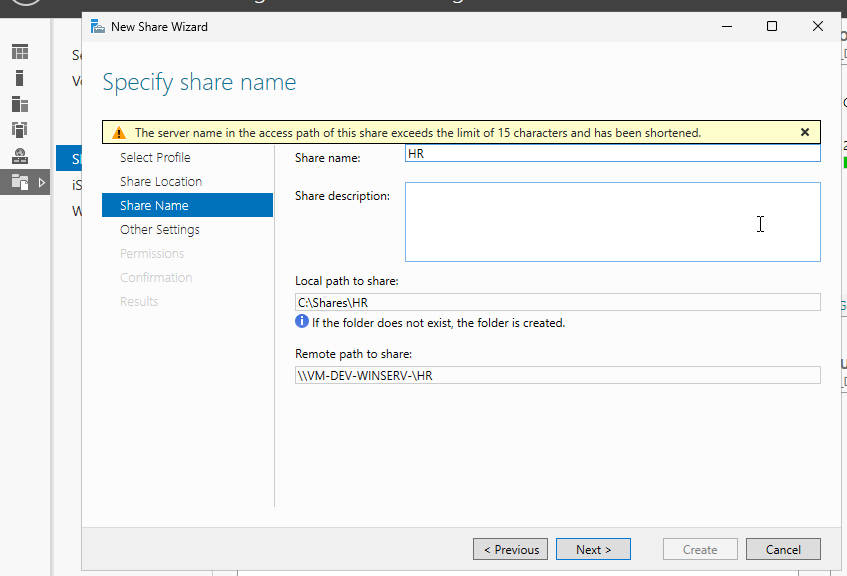
  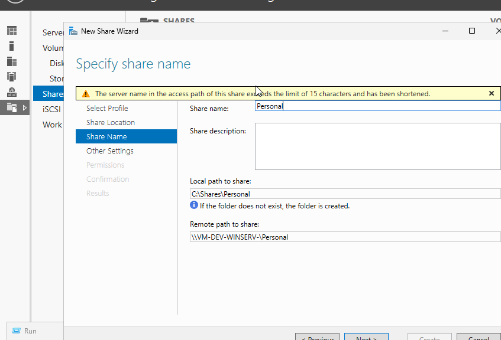
</p>
<p align="center">
  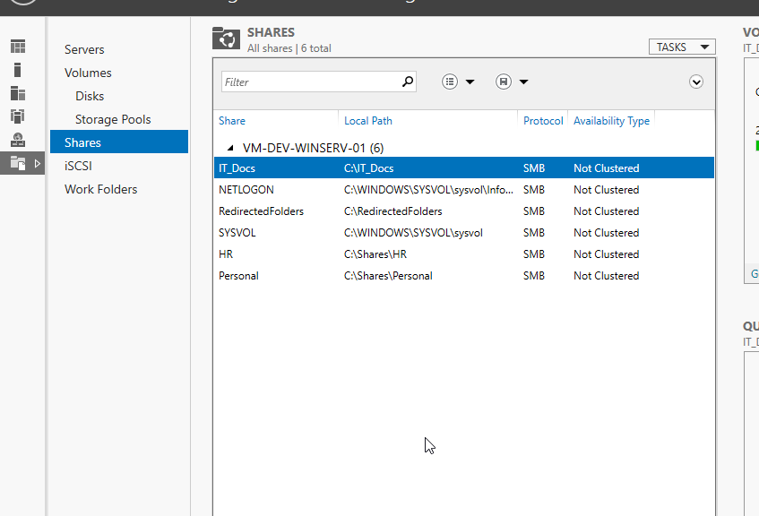
  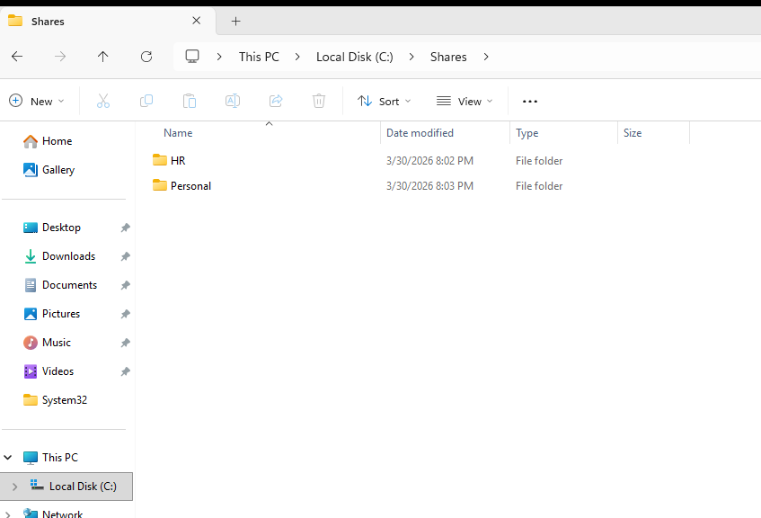
</p>
<p align="center">
  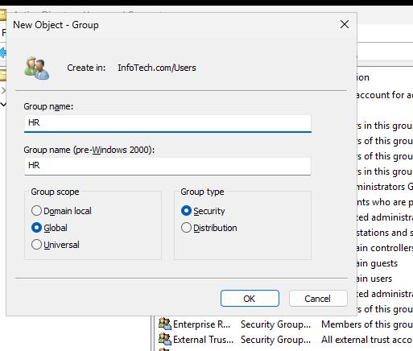
  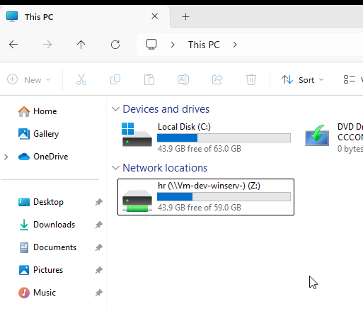
</p>
<p align="center">
  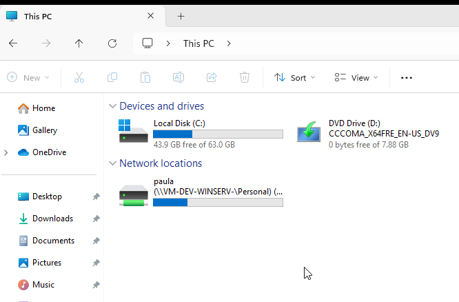
</p>
 
---

# 🚀 Lab 8 — Adding a Second Domain Controller (Windows Server 2025)
 
## 🔍 Key Concept: Why a Second Domain Controller?
 
> A single Domain Controller is a **single point of failure** — if it goes down, the entire domain goes with it.
> A **second DC** provides redundancy, load balancing, and ensures AD services stay available even if one server fails.
> Any changes made on one DC — users, GPOs, policies — **automatically replicate** to the other.
 
<table>
<tr>
<td width="50%" valign="top">
 
**🔁 What is AD Replication?**
- Active Directory uses **multi-master replication** — both DCs can accept changes
- Changes on either server sync to the other automatically via **AD Sites and Services**
- Ensures consistency across the domain — no manual syncing required
- Verified by creating a GPO on one server and confirming it appears on the second
 
</td>
<td width="50%" valign="top">
 
**🌐 DNS Replication**
- Both DCs run DNS — if one DC's DNS goes down, clients fail over to the second automatically
- Each server points to **itself as the preferred DNS** and the **other DC as the alternate**
- This cross-referencing ensures seamless name resolution across the domain at all times
 
</td>
</tr>
</table>
 
---
 
## 🖥️ What Was Configured
 
<table>
<tr>
<td width="50%" valign="top">
 
**🖥️ Deployed Second Server — `VM-DEV-WINSERV-02`**
- Created a new VM in **VMware Workstation Pro** and installed **Windows Server 2025**
- Named the server `VM-DEV-WINSERV-02` to distinguish it from the original DC (`VM-DEV-WINSERV-01`)
- Installed the **Active Directory Domain Services (AD DS)** role on the new server
 
</td>
<td width="50%" valign="top">
 
**🌐 Configured Static IPs & DNS on Both Servers**
- **Server 2 (`VM-DEV-WINSERV-02`):** Static IP `192.168.1.12`, preferred DNS `192.168.1.12` *(itself)*, alternate DNS `192.168.1.10` *(Server 1)*
- **Server 1 (`VM-DEV-WINSERV-01`):** Updated preferred DNS to `192.168.1.10` *(itself)*, alternate DNS to `192.168.1.12` *(Server 2)*
- Each server points to itself first, then the other — ensuring DNS redundancy in both directions
 
</td>
</tr>
<tr>
<td width="50%" valign="top">
 
**🏛️ Promoted to Domain Controller & Joined Existing Domain**
- On `VM-DEV-WINSERV-02`, ran the **AD DS Configuration Wizard** after installing the role
- Selected **"Add a domain controller to an existing domain"** — joined the same domain as Server 1
- Both DCs now visible in **Active Directory Sites and Services**
 
</td>
<td width="50%" valign="top">
 
**🔄 Validated AD & GPO Replication**
- Triggered replication via **Active Directory Sites and Services → Replicate Now**
- Created a test GPO on `VM-DEV-WINSERV-01` — confirmed it appeared automatically on `VM-DEV-WINSERV-02`
- Proved that the replication pipeline is healthy and changes propagate across both DCs in real time
 
</td>
</tr>
</table>
 
---
 
## 📋 Setup Steps
 
**Step 1 — Create & Install the Second Server VM**
In **VMware Workstation Pro**, create a new VM using the same specs as Server 1 → Install **Windows Server 2025** → Name the machine `VM-DEV-WINSERV-02`.
 
**Step 2 — Assign a Static IP to Server 2**
On `VM-DEV-WINSERV-02`, open **Network Connections → Ethernet Properties → IPv4** and set:
 
| Field | Server 1 (`VM-DEV-WINSERV-01`) | Server 2 (`VM-DEV-WINSERV-02`) |
|-------|-------------------------------|-------------------------------|
| IP Address | `192.168.1.10` | `192.168.1.12` |
| Subnet Mask | `255.255.255.0` | `255.255.255.0` |
| Default Gateway | `192.168.1.1` | `192.168.1.1` |
| Preferred DNS | `192.168.1.10` *(itself)* | `192.168.1.12` *(itself)* |
| Alternate DNS | `192.168.1.12` *(Server 2)* | `192.168.1.10` *(Server 1)* |
 
**Step 3 — Install the AD DS Role on Server 2**
On `VM-DEV-WINSERV-02`, open **Server Manager → Add Roles and Features** → Select **Active Directory Domain Services** → Complete the installation wizard.
 
**Step 4 — Promote Server 2 to a Domain Controller**
After installation, click **Promote this server to a domain controller** → Select **"Add a domain controller to an existing domain"** → Enter the existing domain name (e.g., `InfoTech.com`) → Provide **Domain Admin credentials** → Set a DSRM password → Complete the wizard → Server restarts automatically.
 
**Step 5 — Verify Both DCs in AD Sites and Services**
On either server, open **Active Directory Sites and Services** (`dssite.msc`) → Expand **Sites → Default-First-Site-Name → Servers** → Confirm both `VM-DEV-WINSERV-01` and `VM-DEV-WINSERV-02` are listed.
 
**Step 6 — Force AD Replication**
Right-click `VM-DEV-WINSERV-02` under Sites and Services → **Replicate Now** → Confirm the replication completes without errors. Alternatively, run on either server:
```
repadmin /syncall /AdeP
```
 
**Step 7 — Test GPO Replication**
On `VM-DEV-WINSERV-01`, open **Group Policy Management** and create a new test GPO → Switch to `VM-DEV-WINSERV-02` and open Group Policy Management → Confirm the new GPO is visible, proving replication is working end-to-end. ✅
 
---
 
## ✅ Outcome
 
- Second Windows Server 2025 VM (`VM-DEV-WINSERV-02`) deployed and domain-joined successfully
- **AD DS role** installed and server promoted as an **additional Domain Controller** to the existing domain
- Static IPs and cross-referenced DNS configured on both servers for full redundancy
- Both DCs visible in **Active Directory Sites and Services**
- **AD replication** confirmed — GPO created on Server 1 appeared automatically on Server 2 ✅
- Domain is now **fault-tolerant** — if one DC goes offline, the other keeps the domain running

---
 ## 📸 Screenshots
 
<p align="center">
  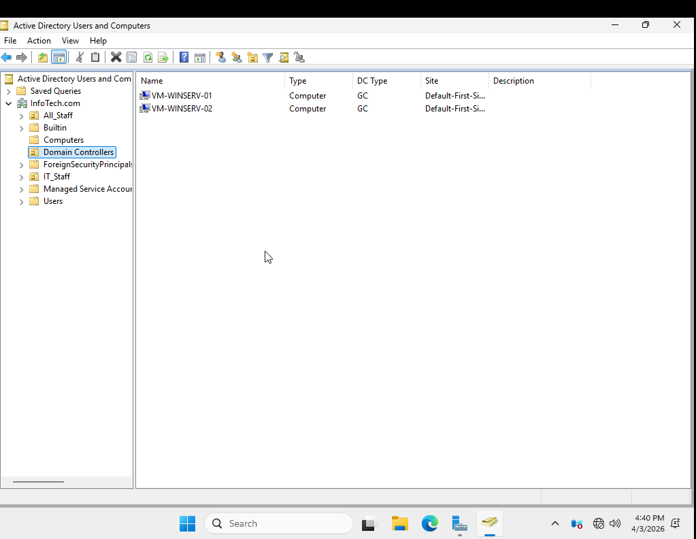
  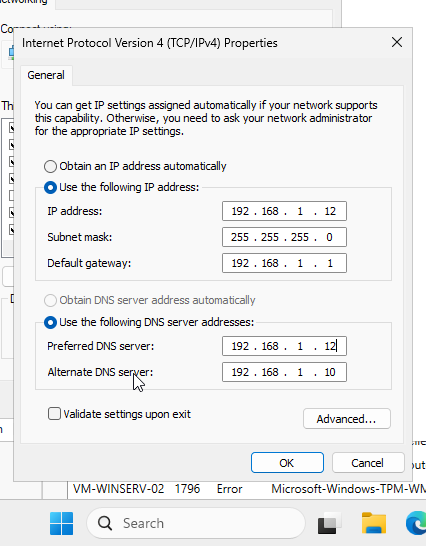
</p>
<p align="center">
  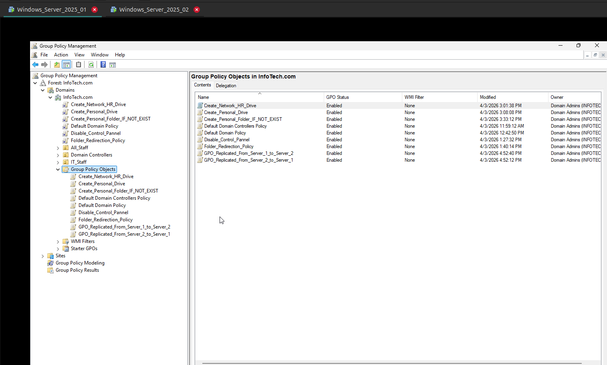
  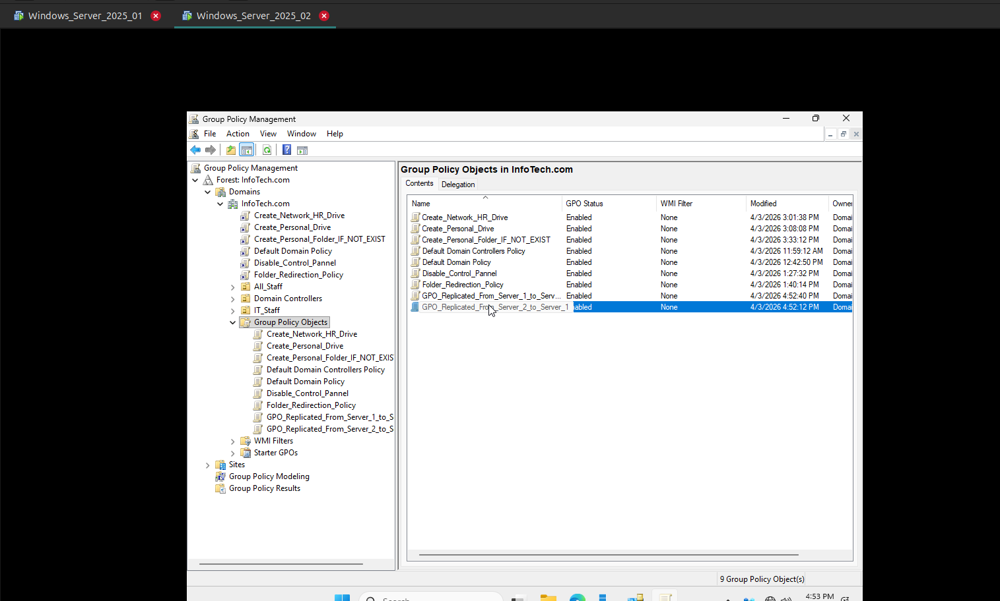
</p>
---

# 🚀 Lab 9 — DHCP Server Setup & Scope Configuration
 
## 🔍 Key Concept: What is DHCP and Why Does It Need AD Authorization?
 
> Without DHCP, every device on a network needs a **manually assigned static IP** — impractical at any scale.
> A **DHCP Server** automatically hands out IP addresses, subnet masks, gateways, and DNS servers to clients the moment they connect.
> In an Active Directory environment, DHCP servers must be **authorized in AD** to prevent rogue DHCP servers from handing out incorrect IPs and disrupting the network.
 
<table>
<tr>
<td width="50%" valign="top">
 
**📦 What is a DHCP Scope?**
- A **scope** is the defined pool of IP addresses the DHCP server can lease to clients
- Each scope has a name, an IP range, a subnet mask, exclusions, and options (DNS, gateway, lease time)
- Exclusions carve out IPs that should **never be dynamically assigned** — protecting static devices like servers, printers, and network gear
- This lab's scope: **`Corporate_LAN`** on the `192.168.1.0/24` network
 
</td>
<td width="50%" valign="top">
 
**🛡️ Why Exclude IP Ranges?**
- Exclusions ensure DHCP never hands out IPs already in use by static devices
- **Lower exclusion (`192.168.1.10–99`)** — reserved for servers and infrastructure (Server 1 is `.10`, Server 2 is `.12`)
- **Upper exclusion (`192.168.1.200–254`)** — reserved for future static devices, printers, or network equipment
- **Effective dynamic lease pool: `192.168.1.100–199`** — 100 addresses available for client machines
 
</td>
</tr>
</table>
 
---
 
## 🖥️ What Was Configured
 
<table>
<tr>
<td width="50%" valign="top">
 
**⚙️ Installed DHCP Server Role**
- Installed **DHCP Server** role via **Server Manager → Add Roles and Features** on `VM-WINSERV-01.InfoTech.com`
- Added required management tools including **DHCP Server Tools**
- Completed the **DHCP Post-Install Configuration Wizard** — security groups created and DHCP server **authorized in Active Directory** ✅
 
</td>
<td width="50%" valign="top">
 
**✅ Authorized the DHCP Server in AD**
- Opened **DHCP Console → Action → Manage Authorized Servers**
- Confirmed `vm-winserv-01.infotech.com` (`192.168.1.10`) is listed as an **Authorized DHCP Server**
- Authorization prevents unauthorized DHCP servers from operating on the domain network
 
</td>
</tr>
<tr>
<td width="50%" valign="top">
 
**📋 Created IPv4 Scope — `Corporate_LAN`**
- Created a new IPv4 scope named `Corporate_LAN` via the **New Scope Wizard**
- **Full range:** `192.168.1.10` – `192.168.1.254` (`/24`, subnet mask `255.255.255.0`)
- **Exclusions added:**
  - `192.168.1.10` – `192.168.1.99` *(servers & static infrastructure)*
  - `192.168.1.200` – `192.168.1.254` *(reserved for future static devices)*
- **Effective lease pool:** `192.168.1.100` – `192.168.1.199` *(100 dynamic addresses)*
 
</td>
<td width="50%" valign="top">
 
**🌐 Configured Scope Options (DNS & Domain)**
- Set **Parent domain** to `InfoTech.com` — clients automatically receive the correct DNS suffix
- Added both DNS servers to the scope options:
  - `192.168.1.10` — `VM-DEV-WINSERV-01` (Primary DC)
  - `192.168.1.12` — `VM-DEV-WINSERV-02` (Secondary DC)
- Clients will use both DNS servers for redundant name resolution
 
</td>
</tr>
</table>
 
---
 
## 📋 Setup Steps
 
**Step 1 — Install the DHCP Server Role**
On `VM-WINSERV-01`, open **Server Manager → Add Roles and Features** → On the *Server Roles* page, check **DHCP Server** → Click **Add Features** when prompted to include management tools → Proceed through the wizard and click **Install**.
 
**Step 2 — Complete the DHCP Post-Install Configuration**
After installation, click the notification flag in Server Manager → **Complete DHCP Configuration** → Follow the wizard:
- *Authorization:* uses domain admin credentials automatically
- Wizard creates DHCP security groups and **authorizes the server in Active Directory**
- Confirm the Summary shows both steps as **Done** ✅
 
**Step 3 — Verify Authorization in the DHCP Console**
Open **DHCP** from Tools in Server Manager → Right-click **DHCP** at the top → **Manage Authorized Servers** → Confirm `vm-winserv-01.infotech.com` appears at `192.168.1.10`.
 
**Step 4 — Create a New IPv4 Scope**
In the DHCP console, expand `vm-winserv-01.infotech.com` → Right-click **IPv4** → **New Scope** → Name it `Corporate_LAN` → Set the IP address range:
 
| Setting | Value |
|---------|-------|
| Scope Name | `Corporate_LAN` |
| Start IP | `192.168.1.10` |
| End IP | `192.168.1.254` |
| Subnet Mask | `255.255.255.0` (`/24`) |
 
**Step 5 — Add Exclusion Ranges**
On the *Add Exclusions* page, add both ranges to protect static devices:
 
| Exclusion Range | Purpose |
|----------------|---------|
| `192.168.1.10` – `192.168.1.99` | Servers, DCs, static infrastructure |
| `192.168.1.200` – `192.168.1.254` | Reserved for future static devices |
 
→ **Effective dynamic pool: `192.168.1.100` – `192.168.1.199`** (100 addresses)
 
**Step 6 — Configure DNS Scope Options**
On the *Domain Name and DNS Servers* page:
- Set **Parent domain** to `InfoTech.com`
- Add DNS server IPs: `192.168.1.10` and `192.168.1.12`
 
These are automatically pushed to every DHCP client alongside their IP lease.
 
**Step 7 — Activate the Scope & Verify the Address Pool**
Complete the wizard and **activate the scope** when prompted → In the DHCP console, expand `Scope [192.168.1.0] Corporate_LAN` → Click **Address Pool** to confirm:
- ✅ `192.168.1.10–254` — full distribution range
- ❌ `192.168.1.10–99` — excluded from distribution
- ❌ `192.168.1.200–254` — excluded from distribution
 
---
 
## ✅ Outcome
 
- **DHCP Server role** installed on `VM-WINSERV-01.InfoTech.com` with management tools
- DHCP server successfully **authorized in Active Directory** — security groups created ✅
- IPv4 scope `Corporate_LAN` created on the `192.168.1.0/24` network
- Exclusions configured to protect the `192.168.1.10–99` and `192.168.1.200–254` ranges
- **Effective dynamic lease pool: `192.168.1.100–199`** (100 addresses available for client machines)
- DNS scope options configured with parent domain `InfoTech.com` and both DC IPs (`192.168.1.10` + `192.168.1.12`)
- Address Pool confirmed in DHCP console — scope is active and ready to serve clients

 
---
 
## 📸 Screenshots
 <p align="center">
  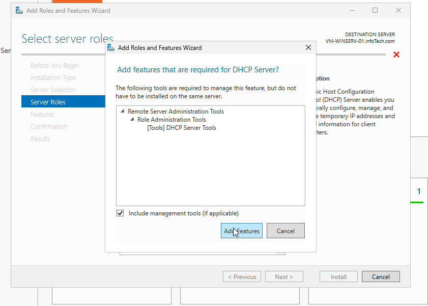
  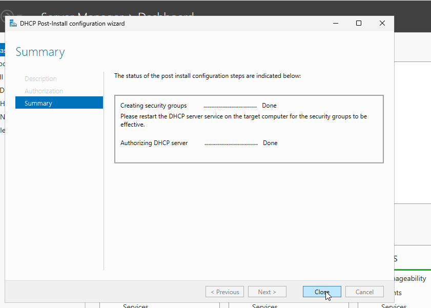
</p>
<p align="center">
  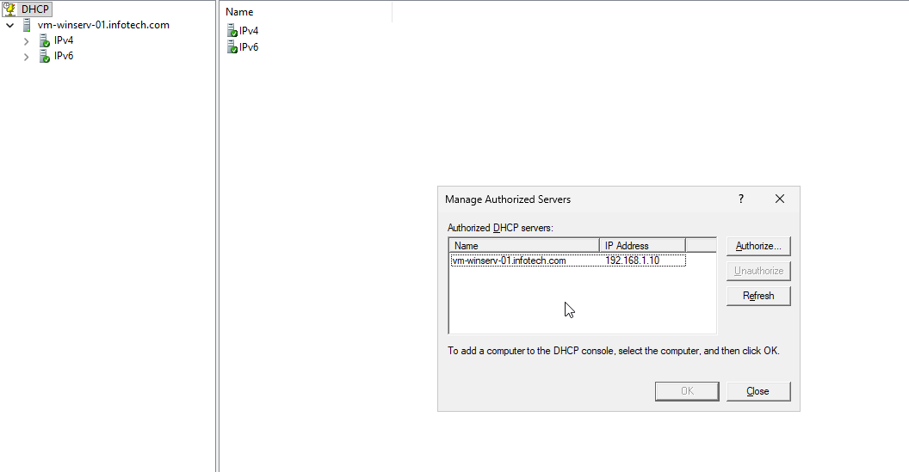
  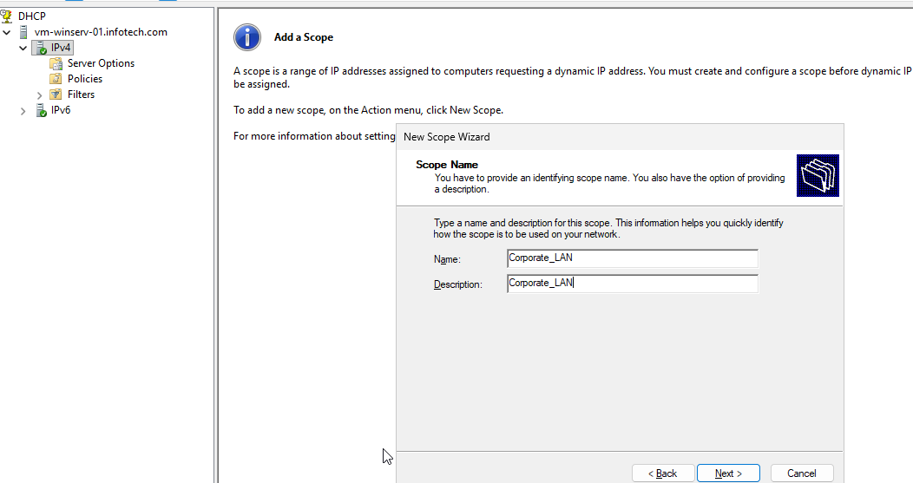
</p>
<p align="center">
  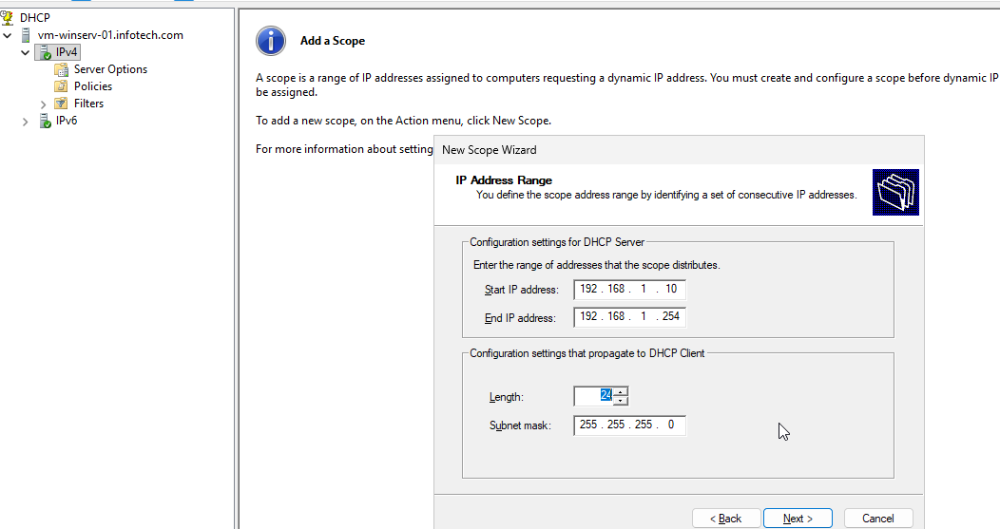
  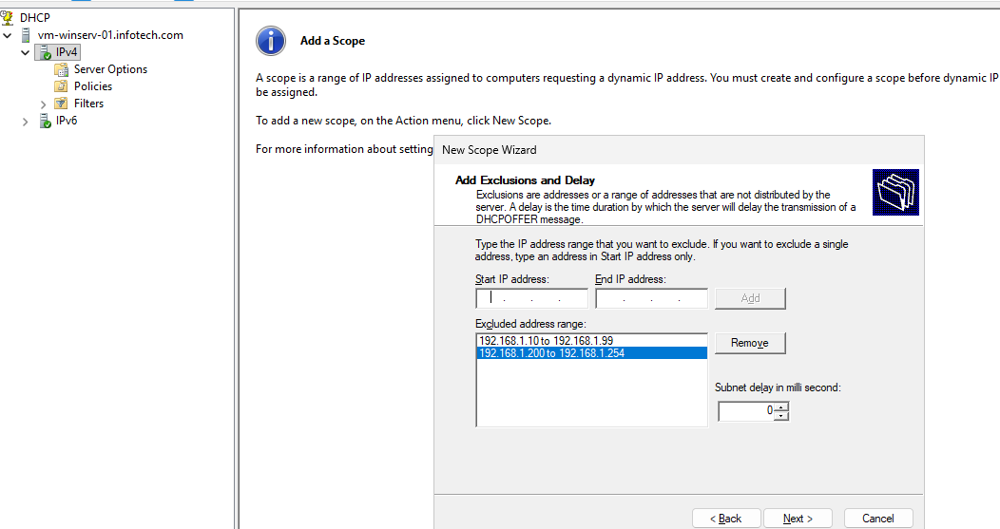
</p>
<p align="center">
  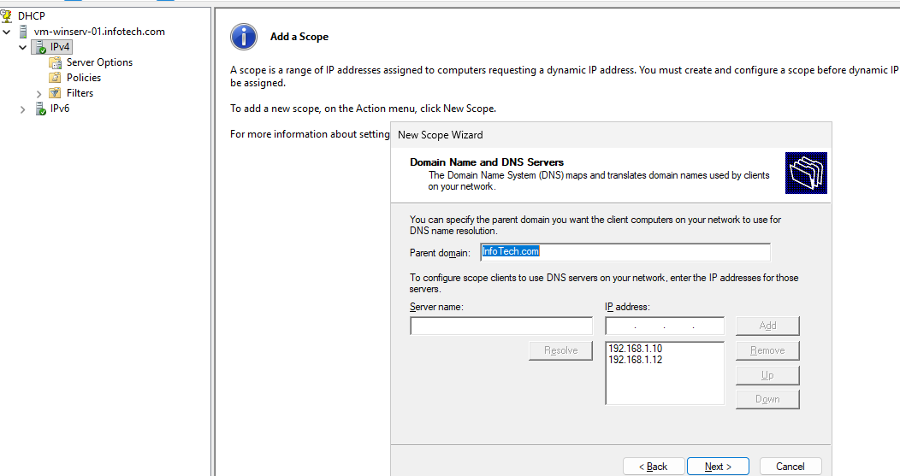
  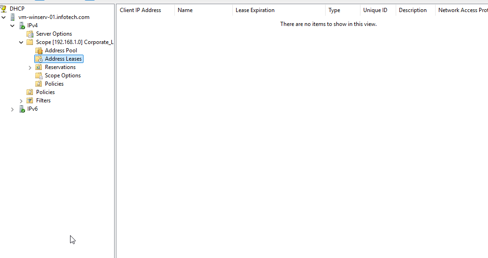
</p>
<p align="center">
  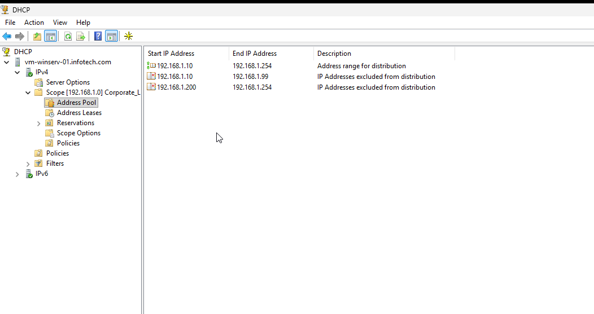
  
</p>


 
---