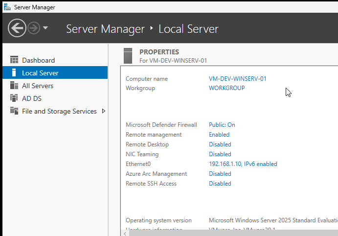

# 🧩 Active Directory & Windows Server Labs

> Simulating a **real-world small business IT infrastructure** — from Domain Controller setup to Group Policy enforcement and client domain joining.

---

## 📌 Overview

This repository documents hands-on labs for deploying and managing a **Windows Server Active Directory (AD) environment**, where an IT administrator is responsible for domain setup, user management, Group Policy configuration, client onboarding, and system troubleshooting.

---

## 🎯 Objectives & 🛠️ Technologies

<table>
<tr>
<td width="50%" valign="top">

**Objectives**

- 🏗️ Build a fully functional **Active Directory environment**
- 🌐 Understand **domain-based network architecture**
- 👥 Practice **user and access management**
- 🔒 Implement **security policies via Group Policy**
- 🧰 Gain real-world **IT Support / SysAdmin experience**

</td>
<td width="50%" valign="top">

**Technologies**

- 🪟 Windows Server 2025
- 💻 Windows 10 (Client Machine)
- 🗂️ Active Directory Domain Services (AD DS)
- 📋 Group Policy Management
- ⚙️ VMware Workstation Pro
- 🐧 Ubuntu (Host Machine)

</td>
</tr>
</table>

---

## 🧪 Lab Structure

| #   | Lab                                        | Status       |
| --- | ------------------------------------------ | ------------ |
| 1   | Windows Server Installation                | ✅ Completed |
| 2   | Active Directory Domain Controller Setup   | ✅ Completed |
| 3   | User & Organizational Unit (OU) Management | ⏳ Pending   |
| 4   | Group Policy Configuration                 | ⏳ Pending   |
| 5   | Domain Joining (Windows 10 Client)         | ⏳ Pending   |
| 6   | DNS & Networking Configuration             | ⏳ Pending   |
| 7   | Troubleshooting Scenarios                  | ⏳ Pending   |
| 8   | Security Hardening & Best Practices        | ⏳ Pending   |

---

# 🚀 Lab 1 — Windows Server Installation

## 🖥️ Environment & VM Configuration

<table>
<tr>
<td width="50%" valign="top">

**Environment**

- **Host OS:** Ubuntu
- **Virtualization:** VMware Workstation Pro
- **Guest OS:** Windows Server 2025

</td>
<td width="50%" valign="top">

**Recommended VM Specs**

- **RAM:** 2 GB min _(4 GB recommended)_
- **Storage:** 60 GB minimum
- **CPU:** 2 cores
- **Network:** NAT _(for internet access)_

</td>
</tr>
</table>

---

## 📋 Setup Steps

**Step 1 — Install VMware Workstation Pro**
Download and install VMware Workstation Pro on your Ubuntu host machine.

**Step 2 — Download Windows Server ISO**
Grab the **Windows Server 2025 ISO** from the [Microsoft Evaluation Center](https://www.microsoft.com/en-us/evalcenter/).

**Step 3 — Create a New Virtual Machine**
Create a new VM in VMware using the recommended configuration above.

**Step 4 — Install Windows Server**
Attach the ISO → Power on the VM → Follow the installation wizard → Select **Standard with Desktop Experience** → Complete setup and log in.

---

## ✅ Outcome

- Successfully installed **Windows Server 2025** on VMware Workstation
- Virtual machine is fully operational and accessible
- Environment is ready for **Active Directory configuration** _(Lab 2)_

---

## 📸 Screenshots

  
  

---

# 🚀 Lab 2 — Active Directory Domain Controller Setup

## 🖥️ What Was Configured

<table>
<tr>
<td width="33%" valign="top">
 
**🖊️ Renamed the PC**
- Renamed the server from the default machine name to a meaningful hostname before promoting it to a Domain Controller
- Requires a **restart** to apply
 
</td>
<td width="33%" valign="top">
 
**🌐 Static IP Address**
- Assigned a **static IPv4 address** to ensure the DC is always reachable at a fixed address on the network
- Required for reliable DNS and AD DS operation
 
</td>
<td width="33%" valign="top">
 
**🗂️ Installed Active Directory**
- Installed the **AD DS role** via Server Manager
- Ran the **AD DS Configuration Wizard** to promote the server to a Domain Controller
- Created a new **forest and root domain**
 
</td>
</tr>
</table>
 
---
 
## 📋 Setup Steps
 
**Step 1 — Rename the PC**
Open **Settings → System → About → Rename this PC** → VM-DEV-WINSERV-01→ Restart to apply.
 
**Step 2 — Configure a Static IP Address**
Go to **Network Adapter Settings → IPv4 Properties** and set:
 
| Field | Example Value |
|-------|--------------|
| IP Address | `192.168.1.10` |
| Subnet Mask | `255.255.255.0` |
| Default Gateway | `192.168.1.1` |
| Preferred DNS | `127.0.0.1`  |
 
**Step 3 — Install the AD DS Role**
Open **Server Manager → Add Roles and Features** → Select **Active Directory Domain Services** → Proceed through the wizard and install.
 
**Step 4 — Promote Server to Domain Controller**
After installation, click **Promote this server to a domain controller** in Server Manager → Select **Add a new forest** → Enter your **Root Domain Name** (e.g., `corp.local`) → Set a DSRM password → Complete the wizard → Server will **restart automatically**.
 
---
 
## ✅ Outcome
 
- Server successfully **renamed** to a meaningful hostname
- **Static IP** configured — DC is reachable at a fixed network address
- **AD DS role** installed and server promoted to **Domain Controller**
- New **Active Directory forest and domain** created and operational

---

## 📸 Screenshots

  
  

 
---
